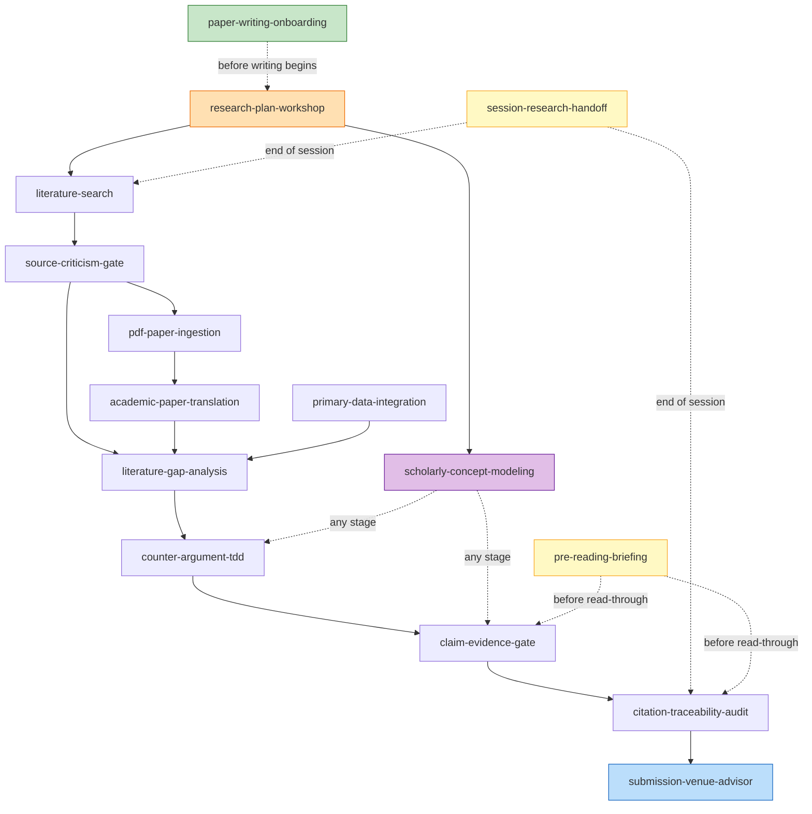

# Scholarly Agent Skills Catalog (English)

Tool-agnostic AI Agent Skills and Rules applying software engineering discipline (DDD, TDD, Static Audit, Invariant Validation, Handoff) to academic research, literature review, and paper writing across all disciplines.

---

## 📋 Skill Catalog

| Skill | Engineering Concept | Description |
|---|---|---|
| [`paper-writing-onboarding`](paper-writing-onboarding/SKILL.md) | Onboarding / Tutorial | Guide first-time paper writers through setup and the phase-based writing workflow |
| [`research-plan-workshop`](research-plan-workshop/SKILL.md) | Requirements Elicitation / Inception | Lock the research question, audience/venue, and definition of done into a one-page plan through dialogue |
| [`primary-data-integration`](primary-data-integration/SKILL.md) | Data Fixtures / DB Seed | Structure, catalog, and integrate primary empirical data into thesis claims and evidence statements |
| [`scholarly-concept-modeling`](scholarly-concept-modeling/SKILL.md) | DDD (Ubiquitous Language) | Define polysemic & domain concepts with bounded contexts to prevent term ambiguity |
| [`counter-argument-tdd`](counter-argument-tdd/SKILL.md) | TDD (Red-Green-Refactor) | Draft potential counter-arguments (Red) before writing paragraphs (Green) to ensure robust argumentation |
| [`claim-evidence-gate`](claim-evidence-gate/SKILL.md) | Invariants / Preconditions | Audit claims against primary sources, empirical data, and citations |
| [`literature-gap-analysis`](literature-gap-analysis/SKILL.md) | Spec Gap Analysis | Compare existing literature (AS-IS) with paper novelty (TO-BE) for Introduction sections |
| [`pdf-paper-ingestion`](pdf-paper-ingestion/SKILL.md) | File Parser / Asset Extraction | Convert PDF papers to Markdown and extract embedded figures/images natively without external tools |
| [`academic-paper-translation`](academic-paper-translation/SKILL.md) | Globalization / i18n | Translate foreign papers into user's native language with parallel text and bilingual glossaries |
| [`literature-search`](literature-search/SKILL.md) | External API / Multi-Provider | Search papers across OpenAlex, arXiv, Crossref, and Semantic Scholar via JSON configuration |
| [`source-criticism-gate`](source-criticism-gate/SKILL.md) | Input Validation / Sanity Gate | Audit source trustworthiness (Tier 1-3) and block unverified websites, blogs, or social media |
| [`citation-traceability-audit`](citation-traceability-audit/SKILL.md) | Traceability / Static Analysis | Audit 1-to-1 matching between body text claims, footnotes, and bibliography references |
| [`session-research-handoff`](session-research-handoff/SKILL.md) | Session Handoff | Maintain research context, pending literature checks, and unproven claims across long sessions |
| [`pre-reading-briefing`](pre-reading-briefing/SKILL.md) | Reading Scaffold / Walkthrough | Present per-section prerequisites, claims, and anticipated objections before read-through, lowering review-phase comprehension cost |
| [`submission-venue-advisor`](submission-venue-advisor/SKILL.md) | Deployment / Release | Recommend the optimal submission venue (preprint server / repository) by field, language, and publication goal |

---

## 🔗 Skill Relationships

> Solid arrows indicate primary data-flow dependencies (output → input). Dashed arrows indicate cross-cutting skills that can be invoked at any stage.

**Legend**:
- 🟢 `paper-writing-onboarding` — Entry-point skill (invoked at project start or by first-time writers)
- 🟠 `research-plan-workshop` — Phase 0 interactive planning skill (invoked when the research question is unsettled)
- 🟣 `scholarly-concept-modeling` — Cross-cutting concept definition skill (invoked when outlining or introducing new concepts)
- 🟡 `session-research-handoff` — Cross-cutting session continuity skill (invoked at session end or context limit approach)
- 🟡 `pre-reading-briefing` — Review-phase reading support skill (invoked before draft read-through or sharing with reviewers)
- 🔵 `submission-venue-advisor` — Terminal publication skill (invoked after all quality gates pass)

