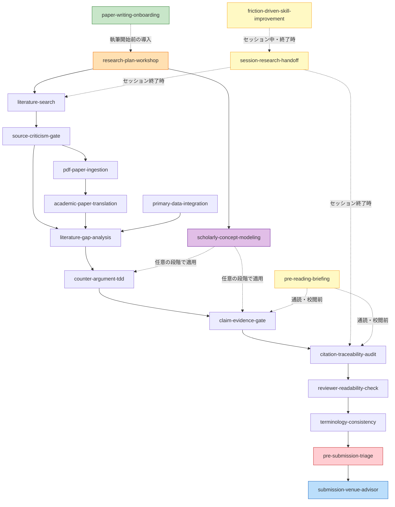

# Scholarly Agent Skills 一覧 (日本語版)

本ディレクトリは、全学術分野（人文学・社会科学・自然科学・工学・医学等）における文献調査・論文執筆をソフトウェア開発の品質規範で駆動するための Cursor / Antigravity Agent スキル集です。

---

## 📋 スキル一覧 (Skill Catalog)

| スキル名 | 対応する開発概念 | 一行説明 |
|---|---|---|
| [`paper-writing-onboarding`](paper-writing-onboarding/SKILL.md) | Onboarding / Tutorial | 初めての論文執筆者に環境セットアップからフェーズ別ワークフローまでを段階案内する |
| [`research-plan-workshop`](research-plan-workshop/SKILL.md) | Requirements Elicitation / Inception | 対話で研究問い・読者/提出先・完成の定義を1ページの研究計画に固める |
| [`primary-data-integration`](primary-data-integration/SKILL.md) | Data Fixtures / DB Seed | 実験データ・アンケート・インタビュー等の独自調査資料を構造化し本文の主張に直結する |
| [`scholarly-concept-modeling`](scholarly-concept-modeling/SKILL.md) | DDD (ユビキタス言語) | 多義的・専門的な基本概念を定義し、表記揺れや意味の混同を防止する |
| [`counter-argument-tdd`](counter-argument-tdd/SKILL.md) | TDD (テスト駆動開発) | 本文執筆前に反論・反例パターン（Red）を箇条書きにし、それを乗り越える論理構成（Green/Refactor）で執筆する |
| [`claim-evidence-gate`](claim-evidence-gate/SKILL.md) | Invariants / 事前条件 | 主張（Claim）に対する一次史料・データ・エビデンス（Evidence）の整合性を検証するゲート |
| [`literature-gap-analysis`](literature-gap-analysis/SKILL.md) | Spec Gap Analysis | 先行研究の到達点（AS-IS）と自説の新規性（TO-BE）の乖離を自動算出する |
| [`pdf-paper-ingestion`](pdf-paper-ingestion/SKILL.md) | File Parser / Asset Extraction | PDF論文をMarkdownへ変換し、埋め込まれた画像・図版を自動切出・保存して埋め込む |
| [`academic-paper-translation`](academic-paper-translation/SKILL.md) | Globalization / i18n | 設定ファイルの自国語に基づき外国語論文を対照翻訳・用語対照表（Glossary）付きで構造化変換する |
| [`literature-search`](literature-search/SKILL.md) | External API / Multi-Provider | 設定ファイルに基づき OpenAlex, arXiv, Crossref, Semantic Scholar 等から多角的に論文を検索・マトリクス反映する |
| [`source-criticism-gate`](source-criticism-gate/SKILL.md) | Input Validation / Sanity Gate | 情報源の信頼度（Tier 1〜3）を評価し、不確かなWebサイトやSNSからの引用を遮断する |
| [`citation-traceability-audit`](citation-traceability-audit/SKILL.md) | Traceability / Static Analysis | 本文中の全主張・記述が出典（脚注・参考文献）と1対1で対応しているか監査する |
| [`session-research-handoff`](session-research-handoff/SKILL.md) | Session Handoff | セッション間や長期執筆における文脈・未解決課題・確認待ち文献の引き継ぎ |
| [`pre-reading-briefing`](pre-reading-briefing/SKILL.md) | Reading Scaffold / Walkthrough | 草稿の通読前に節ごとの前提・主張・想定反論を提示し、校閲期の読解コストを下げる |
| [`pre-submission-triage`](pre-submission-triage/SKILL.md) | Triage / Release Gate | 投稿前ゲートの WARN/FAIL を既知パターンに照合し「要修正/要確認/対応不要」に分類・記録する |
| [`reviewer-readability-check`](reviewer-readability-check/SKILL.md) | Readability Gate / Lint | 本文から内部記号・時刻・バージョン露出を検出し、査読者が読める語彙レベルかを分類・記録する |
| [`terminology-consistency`](terminology-consistency/SKILL.md) | Terminology Lint / Ubiquitous Language | 用語の表記揺れと未 gloss 英語を機械検査し、意味的な揺れを LLM レビューで発見して variants.yml に蓄積する |
| [`submission-venue-advisor`](submission-venue-advisor/SKILL.md) | Deployment / Release | 分野・言語・目的に応じた最適な提出先（プレプリントサーバー等）の選定と投稿手順を案内する |
| [`design-science-research`](design-science-research/SKILL.md) | DSR / Process Evidence | DSR 論文の構造化・存在例/因果実証の区別・プロセスエビデンス管理を支援する |
| [`friction-driven-skill-improvement`](friction-driven-skill-improvement/SKILL.md) | Telemetry / Retrospective | 執筆セッション中の摩擦信号を1行ログに捕捉し、セッション終了時にスキル改善提案として起票する |

---

## 🔗 スキル間の関係図 (Skill Relationships)

> 実線矢印は主要なデータフロー（出力→入力の依存関係）、破線矢印は「任意のタイミングで横断的に適用可能」なスキルを示します。

**凡例**:
- 🟢 `paper-writing-onboarding` — 執筆開始前の導入スキル（初めての執筆・プロジェクト開始時に発動）
- 🟠 `research-plan-workshop` — Phase 0 の対話型計画スキル（研究問いが未確定の時に発動）
- 🟣 `scholarly-concept-modeling` — 概念定義の横断スキル（論文構成や新概念導入時に随時発動）
- 🟡 `session-research-handoff` — セッション引継ぎの横断スキル（作業終了時・コンテキスト制限接近時に発動）
- 🟡 `pre-reading-briefing` — 校閲期の読解支援スキル（草稿通読・査読共有の前に発動）
- 🟡 `friction-driven-skill-improvement` — 摩擦観察・改善起票の横断スキル（セッション中の摩擦検出時・終了時に発動）
- 🔴 `pre-submission-triage` — 投稿前ゲートの判断スキル（原稿ビルド・投稿前のゲート実行時に発動）
- 🔴 `reviewer-readability-check` — 査読者可読性のゲートスキル（章完成時・原稿ビルド時に強制発動）
- 🔴 `terminology-consistency` — 用語一貫性のゲートスキル（章完成時・原稿ビルド時に機械層が強制発動、意味的揺れは LLM レビューで発見・蓄積）
- 🔵 `submission-venue-advisor` — 提出・公開の終端スキル（全検証通過後に発動）

